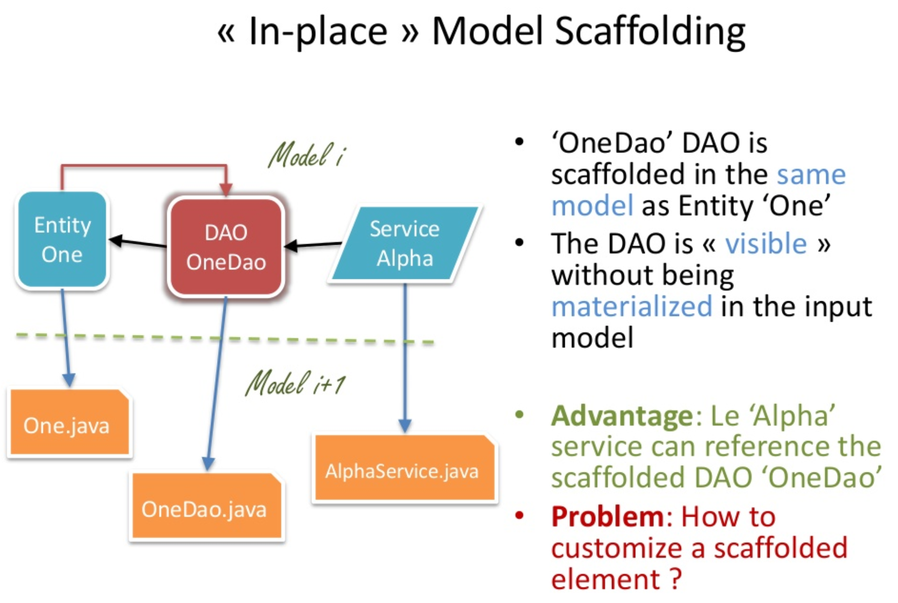
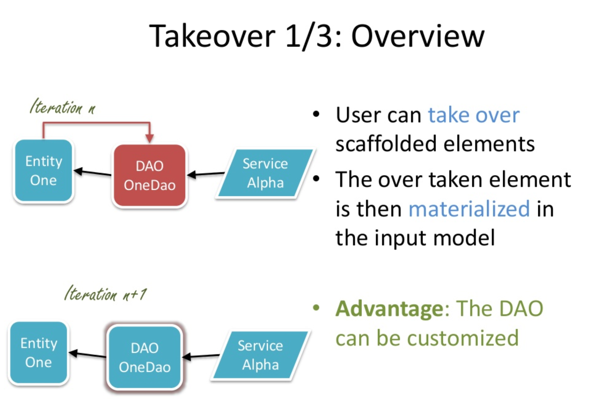
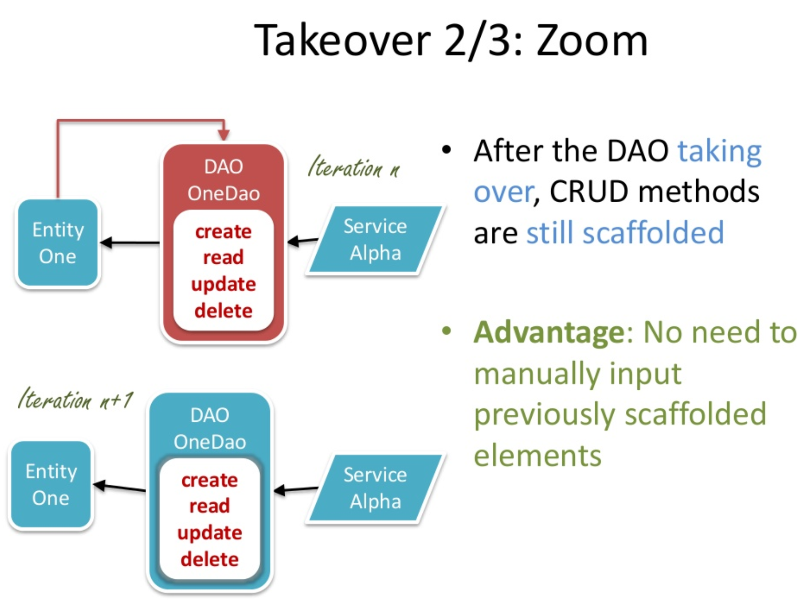
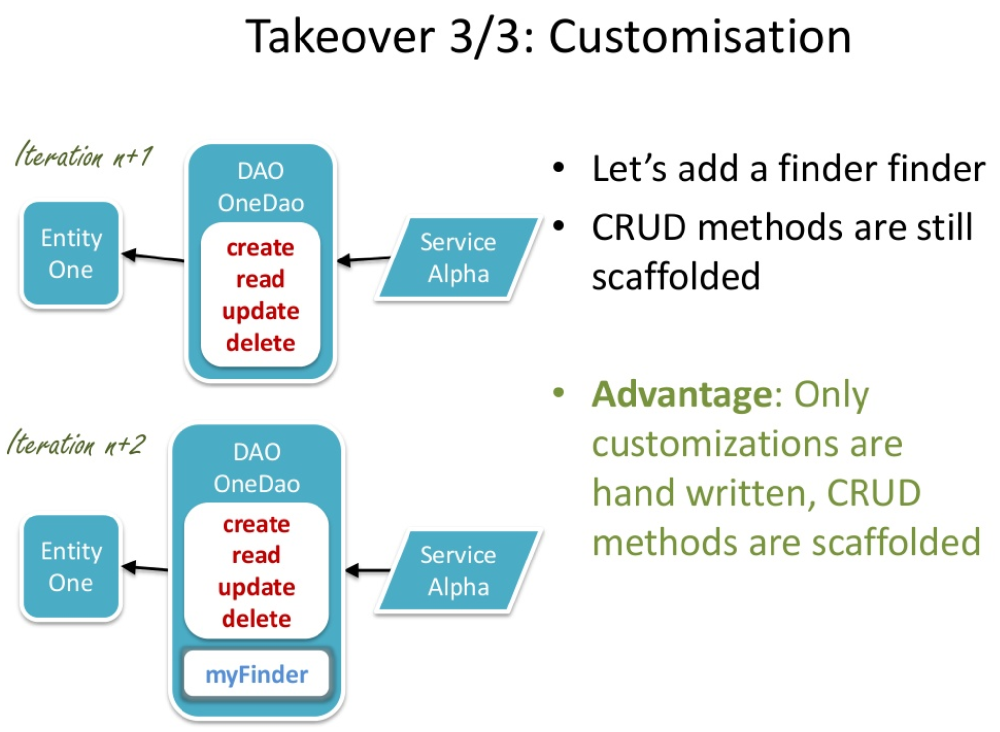
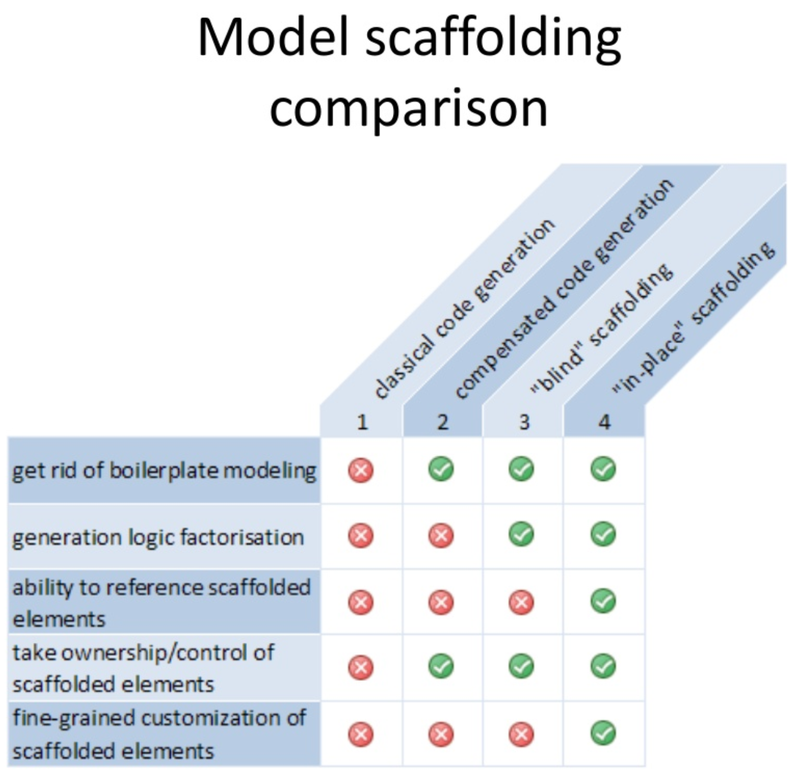

# EMF Scaffolding

EMF Scaffolding allows interactive guided modeling. It takes inspiration from the scaffolding technic popularized by Ruby On Rails and applies it to the [EMF modeling framework](https://fr.wikipedia.org/wiki/Eclipse_Modeling_Framework).

## Dynamic inplace model scaffolding

EMF Scaffolding enhances that approach by implementing the principle of dynamic inplace scaffolding, allowing scaffolding while preserving user defined refinements.

This novel approach have been presented at [RMLL 2009](http://2009.rmll.info/) by [Cédric Vidal](https://www.linkedin.com/in/cedricvidal/). The presentation slides are [available on slideshare](https://fr.slideshare.net/cedric.vidal/emf-scaffolding).

# Taking over

Very advanced scaffolding rules can be implemented without removing the ability for the user to make refinements and take over the scaffolded elements where he see fit.

## Advantages

How does inplace scaffolding compare to other approaches

